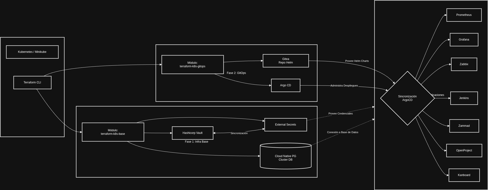

# Laboratorio DevOps en Kubernetes (Minikube)

# Fase 1

Enlace a documentación técnica y videos de implementación: [Ver documentación](https://docs.google.com/document/d/1J5pNGASDyEF_dEGJZbAq9oxsYcKGg48zvZ6mX97L3X4/edit?usp=sharing)

- Infraestructura Core y Gestión de Secretos
  - Stack: Terraform, Helm, HashiCorp Vault, External Secret Operator (ESO), CloudNativePG (CNPG).
  - Descripción: Provisión automatizada del entorno base. Despliegue de bases de datos mediante CNPG y configuración de Vault.

